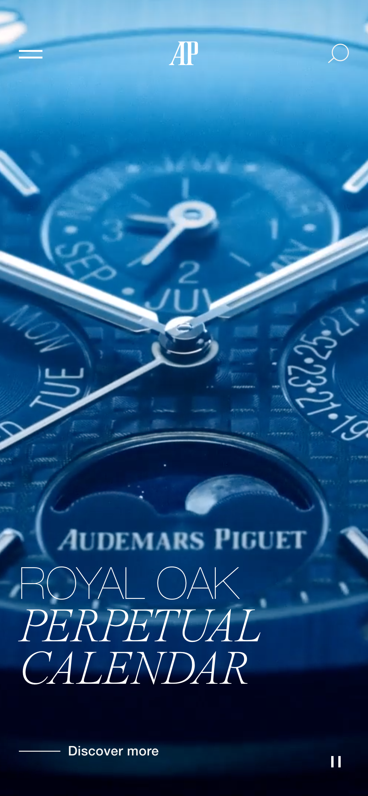

# Procesverslag

Markdown is een simpele manier om HTML te schrijven.  
Markdown cheat cheet: [Hulp bij het schrijven van Markdown](https://github.com/adam-p/markdown-here/wiki/Markdown-Cheatsheet).

Nb. De standaardstructuur en de spartaanse opmaak van de README.md zijn helemaal prima. Het gaat om de inhoud van je procesverslag. Besteedt de tijd voor pracht en praal aan je website.

Nb. Door _open_ toe te voegen aan een _details_ element kun je deze standaard open zetten. Fijn om dat steeds voor de relevante stuk(ken) te doen.

## Jij

  
uitwerken voor kick-off werkgroep

### Auteur:

Sander Oudejans

#### Je startniveau:

Rood

#### Je focus:

Responsive

## Je website

  
uitwerken voor kick-off werkgroep

### Je opdracht:

https://www.audemarspiguet.com/

#### Screenshot(s) van de eerste pagina (small screen):

Homepage

 

#### Screenshot(s) van de tweede pagina (small screen):

Productpagina

## Toegankelijkheidstest 1/2 (week 1)

  
uitwerken na test in 1e werkgroep

### Bevindingen

-   Screen reader is langzaam in gebruik.
-   Veel websites werken niet goed met een screen reader.
-   Screen reader instellen was even lastig.
-   De website die ik namaak heeft de optie om het menu over te slaan.
-   De screenreader leest koppen en broodtekst niet op.

#### Screenreader

De screenreader is in gebruik niet lekker. Doordat je niks ziet is het lastig te bepalen waar de screenreader is. De screenreader leest niet alles op.

Dit kan je oplossen door elementen de juiste naamgeving te geeven en images en alt tekst aan toe te voegen.

#### Muis en Toetsenbord

Niet uitgevoerd

#### Motoriek (shocks, elastiekjes)

Niet uitgevoerd

#### Visueel (brillen, contrast, kleurenblind, dark/light).

Niet uitgevoerd

## Breakdownschets (week 1)

  
uitwerken na afloop 2e werkgroep

### de hele pagina:

  

## Voortgang 1 (week 2)

  
uitwerken voor 1e voortgang

### Stand van zaken

Het namaken van de mobiele versie van de website is tijdrovend, maar lukt uiteindelijk wel. Het menu en de carousel waren twee dingen die lastig waren, omdat ik hier een javascript oplossing voor moest vinden.

Uiteindelijk heb ik de carousel zonder js gemaakt. De hele homepage is op mobiel af (op een paar kleine dingen van het menu na).

### Agenda voor meeting

samen met je groepje opstellen

| student 1   | student 2          | student 3    | student 4        |
| ----------- | ------------------ | ------------ | ---------------- |
| Hoe maak je | en dit             | en ik dit    | en dan ik dat    |
| responsive? | dit als er tijd is | nog een punt | dit wil ik zeker |
|             | ...                | ...          | ...              |

### Verslag van meeting

hier na afloop snel de uitkomsten van de meeting vastleggen

-   Ik moet vooral werken aan het maken van de tweede pagina. Verder gaat alles eigenlijk goed!

## Voortgang 2 (week 3)

  
uitwerken voor 2e voortgang

### Stand van zaken

hier dit ging goed & dit was lastig (neem ook screenshots op van delen van je website en code)

### Agenda voor meeting

samen met je groepje opstellen

| student 1      | student 2          | student 3    | student 4        |
| -------------- | ------------------ | ------------ | ---------------- |
| dit bespreken  | en dit             | en ik dit    | en dan ik dat    |
| en dat ook nog | dit als er tijd is | nog een punt | dit wil ik zeker |
| ...            | ...                | ...          | ...              |

### Verslag van meeting

hier na afloop snel de uitkomsten van de meeting vastleggen

-   Ik moet de laatste puntjes op de i zetten. In het menu moet ik nog wat iconen plaatsen, semantisch correct maken en de website op HTML en CSS valideren.

## Toegankelijkheidstest 2/2 (week 4)

  
uitwerken na test in 8e werkgroep

### Bevindingen

Lijst met je bevindingen die in de test naar voren kwamen (geef ook aan wat er verbeterd is):

#### Screenreader

De screenreader werkt op zowel het origineel als mijn pagina hetzelfde. Alleen mijn menu begint eerst terwijl deze nog niet open is. Het werken met een screenreader is niet fijn, vooral doordat je heel veel linkjes op de pagina hebt. Ik merk wel dat de screenreader alleen links voorleest.

Ik maak gebruik van semantisch correcte code waardoor de screenreader weet wat een element is.

Dit kan ik oplossen door tabindex nog toe te voegen.

#### Muis en Toetsenbord

Met toetsenbord en muis is de pagina goed te bezoeken.

#### Motoriek (shocks, elastiekjes)

Elektrische simulator: Het kost meer moeite om door de pagina te navigeren. Ook had ik een moment waarbij ik iets aanklikte wat ik niet wilde. Vooral op stand 1 was het effect het ergste.

#### Visueel (brillen, contrast, kleurenblind, dark/light).

Peripheral field loss: Met deze bril kan je nog steeds de website zien, maar het is lastig als je je hoofd stil houd.

Low contrast: Door het hoge contrast op mijn website (wit op zwart) is de content nog goed te zien. Alles heeft wel een soort gloed eromheen.

Combined loss / diabetic eye disease: Met deze bril is prima te kijken, alleen de dunne lijstjes zijn niet zo goed te zien.

Blur / glare: Je kan tekst op de pagina niet lezen, omdat het te klein is. Alles ziet dubbel.

Color (geel): Het is alsof je door een zonnebril kijkt. De pagina is prima te bekijken.

Hemifield loss: Door mijn rechteroog zie ik niks, maar met mijn linkeroog wel. Het lijkt alsof mijn hersenen de zwarte blokken weghalen waardoor ik geen last heb van deze 'beperking'.

Central field loss: Als je recht naar voren kijkt, zie je minder goed. Vooral tekst is lastig leesbaar. Je kan je hoofd draaien.

OPLOSSING:
Het contrast van kleine elementen kunnen verhogen zal al helpen om alle elementen zichtbaar te maken. Het lettertype vergroten zou ook een goede optie zijn.

#### Aandacht en concentratie

Met de ballon is het navigeren het lastigste van alle toegankelijksheidstesten. Ik kwam het moeilijkste door mijn pagina heen.

Ik kan nog een aanpassing maken in de witruimte van mijn pagina.

## Voortgang 3 (week 4)

  
uitwerken voor 3e voortgang

### Stand van zaken

hier dit ging goed & dit was lastig (neem ook screenshots op van delen van je website en code)

### Agenda voor meeting

samen met je groepje opstellen

| student 1      | student 2          | student 3    | student 4        |
| -------------- | ------------------ | ------------ | ---------------- |
| dit bespreken  | en dit             | en ik dit    | en dan ik dat    |
| en dat ook nog | dit als er tijd is | nog een punt | dit wil ik zeker |
| ...            | ...                | ...          | ...              |

### Verslag van meeting

hier na afloop snel de uitkomsten van de meeting vastleggen

-   punt 1
-   punt 2
-   nog een punt
-   ...

## Eindgesprek (week 5)

  
uitwerken voor eindgesprek

### Je uitkomst - karakteristiek screenshots:

  

### Dit ging goed/Heb ik geleerd:

Korte omschrijving met plaatjes

  

### Dit was lastig/Is niet gelukt:

Korte omschrijving met plaatjes

  

## Bronnenlijst

  
continu bijhouden terwijl je werkt

<h2>HTML:</h2>

https://www.w3schools.com/accessibility/accessibility_skip_links.php

Voor het skippen van de navigatie met tab

<h2>CSS:</h2>

https://webdesign.tutsplus.com/tutorials/how-to-build-a-simple-carousel-with-vanilla-javascript--cms-41734

Het maken van de carousel. Uiteindelijk heb ik geen javascript gebruikt en de carousel puur met css gemaakt.

https://www.w3docs.com/snippets/html/how-to-create-an-html-button-that-acts-like-a-link.html

Ik kreeg het even niet voor elkaar om de tekst in de button verticaal centreren. Heb padding toegevoegd aan button i.p.v. hoogte en breedte.

https://stackoverflow.com/questions/37815450/flex-items-ignoring-width

Uitleg over flex-wrap om social media iconen juist te positioneren.

https://www.w3schools.com/tags/tag_summary.asp

Hulp van de studentassistent om een simpel uitklapmenu te maken met navigatie voor de footer. Daarnaast W3schools gebruikt :O

https://developer.mozilla.org/en-US/docs/Web/CSS/@media/prefers-contrast

Informatie voor het gebruik van @media voor het veranderen van elementen wanneer de gebruiker het contrast verhoogd.

<h2>Javascript:</h2>
https://khaalipaper.com/javascript/javascript-change-image-onclick-event.php#parentHorizontalTab2

Op de projectpagina moest een afbeelding vervangen worden wanneer de gebruiker op een button klikt. Dit heb ik ooit al eens bij inleiding programmeren gedaan, maar dat was ik natuurlijk al weer vergeten...

https://github.com/amdhanwate/reveal-unreveal-on-scroll/blob/main/main.js

Deze code is voor het vertonen en verwijnen van het menu wanneer de gebruiker scrollt. Deze code heb ik volledig gebruikt.

